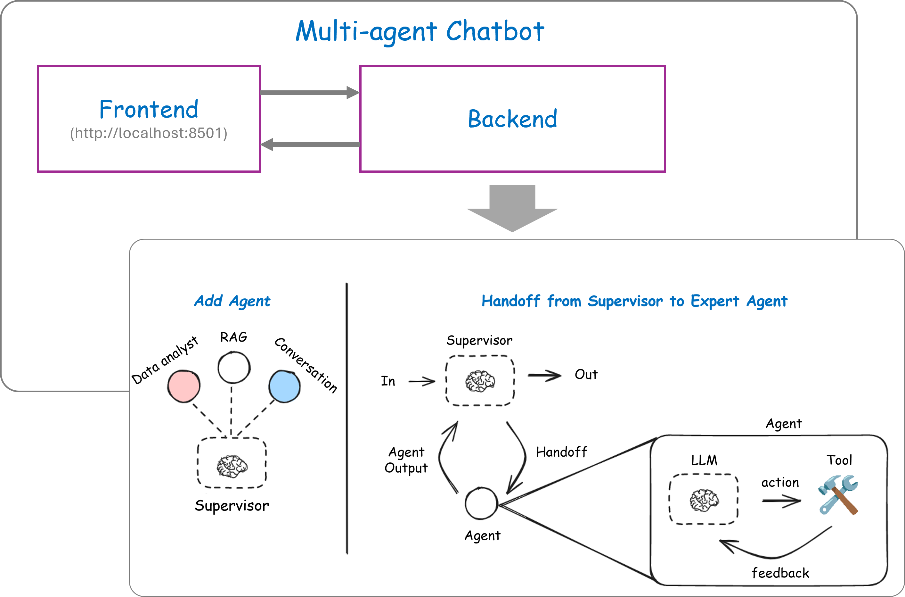
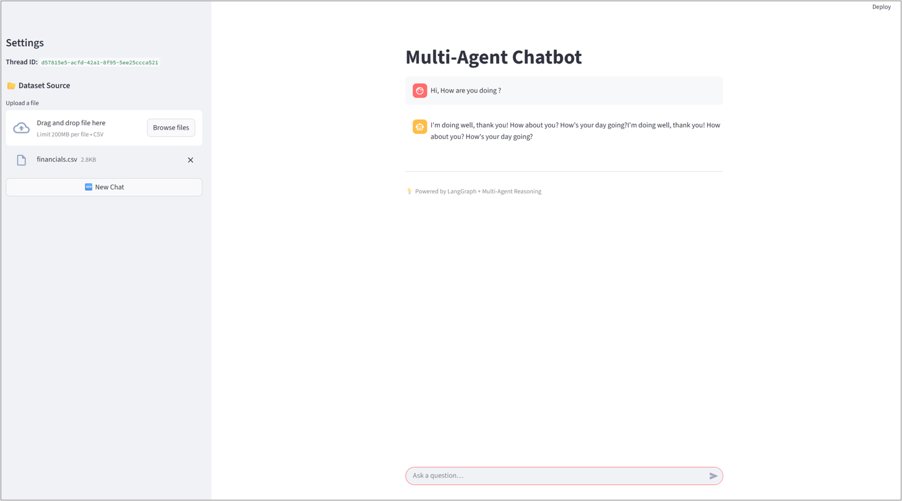
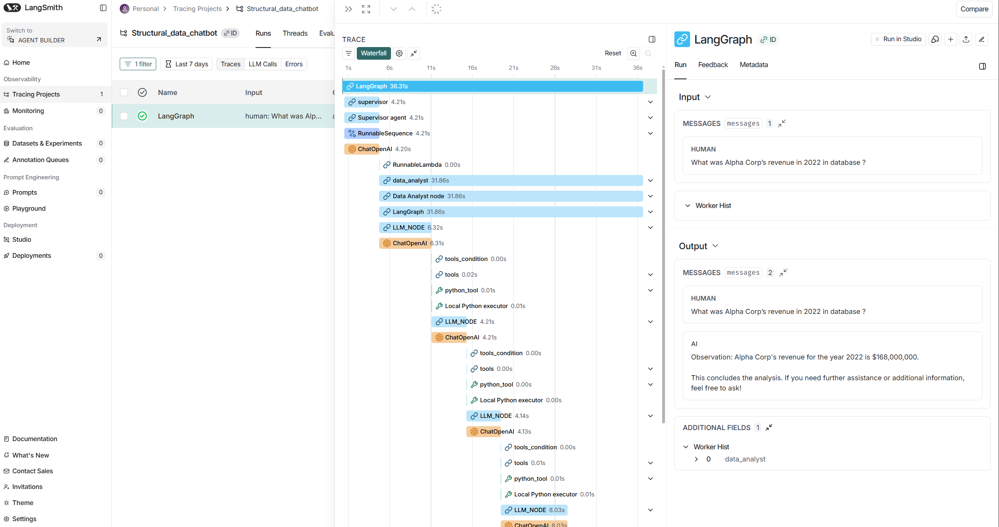

## Multi-agent Chatbot for Data analytics, RAG and Conversation

### Features
* Multi-agent chatbot using LangGraph containing a Supervisor agent and three expert agents (Data analyst, RAG and Conversation) 
* Reusable subgraph to create multi-agent system
* Expert agent has access of tools such as local python executor and knowledge vector DB 
* Data Cleaning and Normalization from csv/txt/xls/json file
* Data Ingestion on Sqlite (local) and Postgres (server based)
* LLM reasoning using OpenAI and Ollama
* Multi Chat interfaces using [CLI](assets/Chatbot_conversation_CLI.txt) as well as [Streamlit frontend](assets/frontend.png)
* Observability and tracking using LangSmith

## 📸 Architecture Overview
Architecture |
:-------------------------:


Frontend Interface |
:-------------------------:


Observability using LangSmith |
:-------------------------:


## Agents task:
* Supervisor agent → Routing between expert agents, data_analyst and conversation
* Data analyst agent → Answer queries related to data by Generate SQL query from natural language, execute SQL query on local python executer as tool and recursively fix the problem
* RAG agent → Question related of pdf documents using knowledge base from chromaDB
* Conversation agent → Casual and friendly conversation

## 📁 Folder Structure
```
Multi_agent_Chatbot/
│
├── assests/                # Images & docs
├── data/                   # I/O data folder
│   ├── in                 
│   ├── temp
├── src/
│   ├── agents/             # Agents modules for multi-agent system
│   ├── configs/            # Configurations files
│   ├── tools/              # Tools modules
│   ├── utils/              # Utility functions
│   ├── chatbot.py          # Streamlit Frontend UI
├── test/                   # Notebooks for testing
├── pyproject.toml          # project file
└── README.md               # Readme file
```

## Data ingestion scripts [csv | txt | json | xls | xlsx | pdf]
    ```bash
    # For ingesting [csv | txt | json | xls | xlsx] file to sqlite db
    uv run python src/utils/data_ingest_sqlite.py --file_path data/in/financials.csv

    # For ingesting pdf file to vector db
    uv run python src/utils/data_ingest_vectordb.py --file_path data/in/SLM_are_Future_of_Agentic_AI.pdf
    ```

## Application usage
1. Create a `.env` environment variables as per below:-

    ```bash
    # LLM
    LLM_PROVIDER = "openai"                     # Select from [openai, ollama]
    MODEL_NAME = "gpt-4o-mini"                  # Appropriate chat model
    EMBEDDING_MODEL = "text-embedding-3-small"  # Appropriate embedding model
    OPENAI_API_KEY = "openai_api"               # OpenAI API key

    # SQlite DB
    DB_PATH="data/temp/ingested.db"

    # (Optional) Langsmith for tracking and observability 
    LANGSMITH_TRACING=true
    LANGSMITH_ENDPOINT=https://api.smith.langchain.com
    LANGSMITH_API_KEY=API_GOES_HERE
    LANGSMITH_PROJECT="Project name"

    ```
2. Install [uv package manager](https://docs.astral.sh/uv/getting-started/installation/)

3. Prepare environment
    ```bash
    uv sync
    ```
4. Start Frontend (Streamlit) using below command
    ```bash
    uv run streamlit run src/chatbot.py 
    ```
5. Open Frontend (Streamlit) → http://localhost:8501

6. (Optional) using CLI mode
    ```bash
    uv run python src/agents/supervisor.py
    ```

## Observability using [LangSmith](https://smith.langchain.com/)
* Set the environment variables in `.env` file as mentioned above.
* Open the `https://smith.langchain.com` to track the chatbot performance

## TODOs
1. [ ] Storing conversation threads
2. [ ] Cloud deployment
3. [ ] Test cases 

## Limitations
1. Multi-step analytical questions (e.g., nested comparisons, windowed aggregations) may fail due to cascading errors in SQL generation and execution.
2. Token-by-token streaming of markdown, especially code fences, can cause formatting issues in the frontend. This is a known limitation of incremental markdown rendering.
3. When using locally hosted small LLMs (≈8B parameters), reasoning depth, tool usage accuracy, and routing reliability are reduced compared to larger models.
4. The Supervisor agent can struggle to distinguish between closely related intents (e.g., RAG vs structured data queries), especially when user queries are underspecified.
5. The system prioritizes clarity and extensibility over production concerns such as authentication, concurrency control, and resource isolation.
6. Data cleaning and normalization infer types automatically, which may not always match domain-specific expectations for ambiguous columns.

## Design Decision and Tradeoffs

1. LangGraph-based Multi-Agent Architecture with a Supervisor agent orchestrating multiple expert agents (Data Analyst, RAG, Conversation), each encapsulated as a reusable subgraph.

    **Trade-off:**
- ✅ Clear separation of responsibilities and extensibility
- ✅ Fine-grained control over agent routing and tool access
- ❌ Increased orchestration complexity compared to a single-agent design
- ❌ Requires careful handling of state propagation and streaming across subgraph

2. Supervisor-driven Intent Routing enable a query to first processed by a Supervisor agent that decides which expert agent should handle the request. This approach mirrors production agent routers but introduces probabilistic behavior.

    **Trade-off:**
- ✅ Centralized control and easier debugging of routing logic
- ✅ Enables future extensions (e.g., additional agents)
- ❌ Routing quality depends heavily on LLM reasoning
- ❌ Closely related intents (e.g., RAG vs data analysis) can cause misclassification

3. Tool-based Data Analysis via SQL & Python Execution enables the Data Analyst agent answers structured data questions by generating SQL queries and executing them via a local Python executor (SQLite/Postgres). This was preferred over pure RAG for tabular data due to accuracy and transparency.

    **Trade-off:**
- ✅ Guarantees answers are grounded in provided data
- ✅ Avoids hallucination from LLM internal knowledge
- ❌ Multi-step reasoning (generate → execute → debug) can fail on complex queries
- ❌ Execution safety requires restricted environments and careful validation


4. Local-first Storage (SQLite + Optional Postgres) is used as the default local database, with optional Postgres support for server-based deployment. This balances simplicity with extensibility.

    **Trade-off:**
- ✅ Easy local setup and fast iteration
- ✅ No external dependencies required for basic usage
- ❌ Not suitable for high-concurrency or large-scale datasets
- ❌ Schema inference is best-effort and may require manual tuning

5. Streaming at Supervisor Level with subgraphs=True enable the Token-level streaming is implemented at the parent (supervisor) graph level using subgraphs=True.

Trade-off:
- ✅ Enables real-time streaming from subgraph agents
- ✅ Preserves a unified user experience across agents
- ❌ Requires filtering of routing tokens and final message chunks
- ❌ Streaming markdown (especially code blocks) introduces UI complexity

6. Streamlit-based Frontend was chosen for rapid prototyping and ease of interaction. Streamlit is suitable for demos and internal tools but not ideal for fine-grained UI control.

    **Trade-off:**
- ✅ Fast development and minimal boilerplate
- ✅ Built-in support for chat-style UIs
- ❌ Limited control over incremental markdown rendering
- ❌ Code blocks and text streaming require careful handling

7. LLM Provider Abstraction (OpenAI / Ollama) supports both cloud-based (OpenAI) and local (Ollama) LLMs via configuration. This abstraction allows experimentation across model sizes and infrastructures.

    **Trade-off:**
- ✅ Flexibility in deployment environments
- ✅ Cost control and offline experimentation
- ❌ Smaller local models show reduced reasoning quality
- ❌ Behavioral differences across providers require tuning

